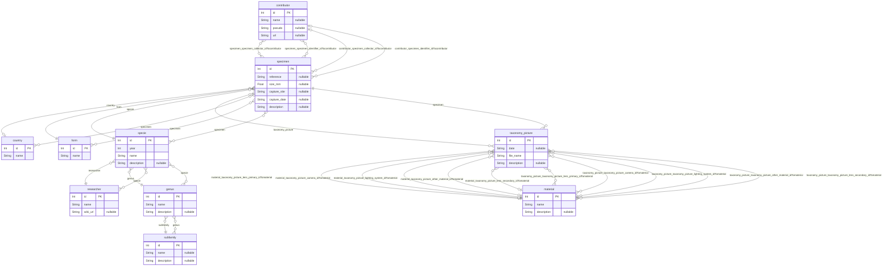

Work in progress to the new **Myrmecophoto** website, continuous deployment at https://myrmecophoto.netlify.app/. Based on Nuxt hosted by Netlify. The original website that I migrate is http://www.myrmecophoto.fr/ (based on PHP CodeIgniter, MySQL, from scratch Sass & jQuery)

[](https://app.netlify.com/sites/myrmecophoto/deploys)

## Setup

Require Node v18, copy/paste `.env` from `.env.local` and exec `yarn`

## Development Server

```bash
# Start the development server on http://localhost:3000
yarn dev

# Test SSG and serve at http://localhost:3000
yarn serve-generate
```

## Database

SQLite Database is managed by Prisma ORM. When Nuxt generate static build, it pre-render call api (check `./server/api/` files) by Nitro server (check `./nuxt.config.ts`) and provide a flatten result in JSON. `api/getSpecies` & `api/getTaxa` provide all datas needed to display "Photos Spécimens" section pages. For "SSG" it's useful and website doesn't need to access database on live website. The Database can be more granular with optimized tables, but in my case I prefer to spend time on other things, like UI/UX features. As far as possible, I have followed the conventions proposed by [www.sqlstyle.guide](https://www.sqlstyle.guide/). Below is the Mermaid diagramme ERD of Myrmecophoto Database :



**Update content** with Prisma Studio

```bash
yarn prisma studio
```

**Update schema** only by `prisma/schema.prisma`

```bash
# update `prisma/schema.prisma`
yarn prisma migrate dev --name my_changes_name --create-only
# check the `prisma/migrations/{time}_my_changes/migration.sql` file & update if necessary
yarn prisma migrate dev
```

**Prisma is broken**, delete all files in `./prisma` except `database.sqlite` & minimal config of `schema.prisma`

```bash
yarn init-db
```

## Note about email spam protection

I want to share 100% source code, but don't want to be spammed from robots by displaying my email address. To do this in a full SSG & open source code on Github, I've made a strategy to not directly show my email address. The only pre-requisite is the ability of using environnement variable on server (Netlify).

- store the clear address on a `.env`, add the same variable on the server & refer it on `nuxt.config.js`
- `server/api/getEncryptedEmailContact` is prerender by Nitro & use a composable to encrypt email
- at this moment, the encrypted method just reverse all the characters
- in the vue application, it fetch `server/api/getEncryptedEmailContact` & display data with a tricks HTML to reverse direction reading
- the real decrypt happens on event click on email, that redirect to the correct link mailto

I think it can be possible to enhance encryption using CSS technique to display mixed characters...

## TODO for the first release

- [x] build "list of articles" page
  - [x] engine (route, etc.) => custom Vue
  - [x] get all content
- [ ] build all articles pages
  - [x] engine (route, etc.) => Nuxt Content
  - [x] add "articles" content
  - [ ] add "outdoor pictures" as articles content (from old DB)
- [ ] prepare SQLite database (imported from existing MySQL)
  - [x] rename table & field
  - [x] delete unused table
  - [x] install & configure Prisma
  - [x] test simple query on JAMStack
  - [ ] add table `picture_taxonomy_material` & alter table `picture_taxonomy`
- [x] better lint JS/TS
- [x] build "list of specimens pictures" page
  - [x] engine (route, etc.) => custom Vue => use Prisma
  - [x] build all request api
  - [x] get all content
- [x] build all specimens pictures pages
  - [x] engine (route, etc.) => custom Vue => use Prisma
  - [x] build all request api
  - [x] get all content
- [ ] write contact page (hybrid ?)
- [ ] write about page
- [ ] Integrate entire site UI/UX
  - [x] Install framework CSS (UnoCSS ?)
  - [x] Install & configure Stylelint
  - [x] Add reset
  - [x] Add typography
  - [ ] Add layout
  - [ ] Add custom Font
- [ ] error page (404)
- [ ] polish all text
- [ ] test between module `nuxt webvitals` <=> `netlify webvitals`
- [ ] add robot.txt
- [ ] Add favicons
- [ ] add sitemap.xml
- [ ] add schema.org ?
- [ ] add GA
- [ ] add 302 from old website
- [ ] migrate domain
- [ ] test Cloudinary or similar image hosting
- [ ] write a complete README
- [ ] enhance email encryption
