**Myrmecophoto** is a scientific macro photography website dedicated to French ant species (myrmecology). This modern full-stack application showcases taxonomic data, macro photography techniques, and articles about ants, built with Nuxt 4 and optimized for performance with static site generation.

[](https://app.netlify.com/sites/myrmecophoto/deploys)

       

🔗 **Live**: https://myrmecophoto.fr

## Quick Start

```bash
# Requirements: Node v22.19
cp .env.example .env
yarn

# Start the development server on http://localhost:3000
yarn dev

# Test SSG and serve at http://localhost:3000
yarn serve-generate
```

## Production Deployment

**Live URL**: https://myrmecophoto.fr
**Hosting**: Netlify with automatic deployment from Git

### Build Command
```bash
yarn generate
```

## Tech Stack

- **Nuxt 4** + TypeScript
- **Prisma ORM** + SQLite
- **UnoCSS** + SCSS
- **PhotoSwipe** for image galleries
- **Yarn 4** package manager
- **Static site generation** (SSG) with Netlify hosting

## Database

SQLite database is managed by Prisma ORM with a focus on myrmecological taxonomy accuracy. During static site generation (`yarn generate`), Nitro prerenders API routes (`./server/api/`) to JSON payloads, eliminating runtime database dependencies in production. The `api/getSpecies` and `api/getTaxa` endpoints provide all taxonomic data for the "Photos Spécimens" section.

**Important**: The database schema follows [SQL Style Guide](https://www.sqlstyle.guide/) conventions and maintains scientific accuracy for taxonomical relationships.

**Two databases are used**:
- `prisma/database.sqlite` (versioned) - Taxonomic data for species, specimens, and photos
- `.data/content/contents.sqlite` (git-ignored) - Nuxt Content articles

Below is the Entity Relationship Diagram of the Myrmecophoto database:


### Database Management

**Update content** via Prisma Studio:
```bash
yarn prisma studio
```

**Update schema** by modifying `prisma/schema.prisma`:
```bash
# 1. Modify prisma/schema.prisma
yarn prisma migrate dev --name my_changes_name --create-only

# 2. Review generated migration.sql
# Check prisma/migrations/{timestamp}_my_changes/migration.sql

# 3. Apply migration
yarn prisma migrate dev
```

**Emergency recovery** (if Prisma is broken):
```bash
yarn init-db
```
⚠️ **Warning**: Never run `yarn init-db` in production. This command reinitializes the database from scratch.

## Managing Taxon Images

### Adding Images to Existing Taxons

1. **Name images correctly**: `{genus-specie}-{form}-{view}-{specimen-ref}.jpg`
  - Example: `camponotus-cruentatus-major-face-f0002.jpg`

2. **Place in taxon directory**: `public/img/taxons/{genus-specie}/`

3. **Process with XnView MP** using presets in `./preset-xnview/` folder

4. **Add to database** via Prisma Studio:

```bash
yarn prisma studio
```

Add entries in `taxonomy_picture` table linking to specimen

5. **Start development**: `yarn dev` (manifest regenerates automatically)

### Adding New Species

1. Add taxonomic data in Prisma Studio: `subfamily` → `genus` → `specie` → `specimen`
2. Follow image process above
3. Use lowercase names without accents for directories and URLs

## SSG Image Optimization Strategy

This project implements an advanced image optimization architecture for maximum web performance with zero runtime dependencies. The system achieves exceptional Core Web Vitals through automated multi-format generation, intelligent manifest caching, and optimized responsive images.

### Key Features

- **Multi-format pipeline**: AVIF (5 sizes: 300/600/900/1200/1600px) + JPEG fallbacks (1200px + 300px thumbnail)
- **Intelligent caching**: Image manifest regenerates only when images change (~0.1s vs 7s full generation)
- **Build-time indexing**: `scripts/generate-image-manifest.mjs` generates `composables/image-manifest.json` with real dimensions
- **Zero runtime overhead**: Static manifest eliminates API calls and database queries
- **XnView MP presets**: Standardized batch processing with presets in `./preset-xnview/`

### How It Works

1. **External processing**: Raw images processed with XnView MP using presets (AVIF + JPEG generation)
2. **Manifest generation**: Build script scans `public/img/`, extracts dimensions, generates JSON manifest
3. **Smart caching**: Manifest only regenerates when images are added/modified/deleted
4. **Runtime optimization**: Composable `useImageData.ts` provides helpers (`useTaxonImageData`, `useArticleImageData`) with pre-calculated properties
5. **Template rendering**: Vue components use computed `finalSrc`, `thumbnailSrc`, `aspectRatio` for optimal performance



```mermaid
flowchart TB
    subgraph BUILD ["🔧 Build Pipeline"]
        A[📁 Raw Images] --> B[XnView MP<br/>Batch Processing]
        B --> C[Multi-format Generation]
        C --> D[⚡ AVIF<br/>Optimized format<br/>300•600•900•1200•1600px]
        C --> E[📄 JPEG<br/>Fallback<br/>1200px + 300px thumbnail]
    end

    subgraph MANIFEST ["📋 Manifest Generation"]
        D --> F[⚙️ generate-image-manifest.mjs]
        E --> F
        F --> G[📝 image-manifest.json<br/>+ Real Dimensions]
    end

    subgraph RUNTIME ["⚡ SSG Runtime"]
        G --> H[useImageData.ts<br/>Direct Import]
        H --> I[Computed Properties<br/>finalSrc • aspectRatio • thumbnailSrc]
        I --> J[Optimized Templates<br/>TaxonPicture • SpecieCard • PictureArticle]
        J --> K[🖼️ Picture Elements<br/>AVIF + JPEG Fallback]
    end

    BUILD --> MANIFEST
    MANIFEST --> RUNTIME

    classDef buildStyle fill:#e3f2fd,stroke:#1976d2,stroke-width:2px,color:#000
    classDef manifestStyle fill:#fff3e0,stroke:#f57c00,stroke-width:2px,color:#000
    classDef runtimeStyle fill:#e8f5e8,stroke:#388e3c,stroke-width:2px,color:#000

    class BUILD,A,B,C,D,E buildStyle
    class MANIFEST,F,G manifestStyle
    class RUNTIME,H,I,J,K runtimeStyle
```

### Implementation Example

```vue
<script setup>
import { useTaxonImageData } from '~/composables/useImageData'

// Simple, unified API for any image context
const imageData = useTaxonImageData(genusName, specieName, fileName)
</script>

<template>
  <!-- Clean, performance-optimized template -->
  <picture>
    <source
      type="image/avif"
      :srcset="imageData.avifSrcset"
      sizes="(max-width: 768px) 100vw, 800px"
    />
    
  </picture>
</template>
```

### Performance Benefits

- **Superior compression**: AVIF format reduces file size by up to 80% compared to JPEG
- **Zero layout shift**: Pre-calculated aspect ratios prevent Cumulative Layout Shift (CLS)
- **Optimal loading**: Intelligent srcsets with lazy loading for fast page loads
- **SEO-friendly**: JPEG fallbacks ensure compatibility and proper indexing
- **Fast rebuilds**: Intelligent caching reduces development server startup time by ~30-40%

## Email Spam Protection Strategy

This project implements a novel approach to protect email addresses from bot scrapers while keeping 100% of the source code public on GitHub. The solution leverages SSG prerendering and runtime decryption to prevent spam without compromising code transparency.

### How It Works

1. **Environment variable storage**: Email address stored in `.env` (local) and Netlify environment variables (production), referenced in `nuxt.config.ts`

2. **Build-time encryption**: `server/api/getEncryptedEmailContact` is prerendered by Nitro, using a composable to encrypt the email (currently simple character reversal)

3. **Obfuscated display**: Vue application fetches the encrypted endpoint and displays it using CSS `direction: rtl` to reverse character order in the DOM

4. **Runtime decryption**: User click event triggers decryption and constructs the proper `mailto:` link

### Benefits

- **Bot protection**: Email address never appears in plain text in HTML source or JavaScript bundles
- **SSG compatible**: Works entirely with static generation, no runtime server required
- **Open source friendly**: No secrets exposed in public repository
- **User experience**: Seamless interaction, email link works normally for real users
