Work in progress to the new **Myrmecophoto** website, continuous deployment at https://myrmecophoto.netlify.app/. Based on Nuxt hosted by Netlify. The original website that I migrate is http://www.myrmecophoto.fr/ (based on PHP CodeIgniter, MySQL, from scratch Sass & jQuery)

[](https://app.netlify.com/sites/myrmecophoto/deploys)

## Setup

Require Node v20, copy/paste `.env` from `.env.local` and exec `yarn`

### Note about Windows environnement

I use `winget` to manage package on windows. And `fnm` to manage node versions.

```bash
# Start session coding on win10
fnm env --use-on-cd | Out-String | Invoke-Expression
fnm use
```

## Development Server

```bash
# Start the development server on http://localhost:3000
yarn dev

# Test SSG and serve at http://localhost:3000
yarn serve-generate
```

## Database

SQLite Database is managed by Prisma ORM. When Nuxt generate static build, it pre-render call api (check `./server/api/` files) by Nitro server (check `./nuxt.config.ts`) and provide a flatten result in JSON. `api/getSpecies` & `api/getTaxa` provide all datas needed to display "Photos Spécimens" section pages. For "SSG" it's useful and website doesn't need to access database on live website. The Database can be more granular with optimized tables, but in my case I prefer to spend time on other things, like UI/UX features. As far as possible, I have followed the conventions proposed by [www.sqlstyle.guide](https://www.sqlstyle.guide/). Below is the Mermaid diagramme ERD of Myrmecophoto Database :


**Update content** with Prisma Studio

```bash
yarn prisma studio
```

**Update schema** only by `prisma/schema.prisma`

```bash
# update `prisma/schema.prisma`
yarn prisma migrate dev --name my_changes_name --create-only
# check the `prisma/migrations/{time}_my_changes/migration.sql` file & update if necessary
yarn prisma migrate dev
```

**Prisma is broken**, delete all files in `./prisma` except `database.sqlite` & minimal config of `schema.prisma`

```bash
yarn init-db
```

## Managing Taxon Images

### Adding Images to Existing Taxons

1. **Name images correctly**: `{genus-specie}-{form}-{view}-{specimen-ref}.jpg`
   - Example: `camponotus-cruentatus-major-face-f0002.jpg`

2. **Place in taxon directory**: `public/img/taxons/{genus-specie}/`

3. **Process with XnView MP** using presets in `./preset-xnview/` folder

4. **Add to database** via Prisma Studio:

   ```bash
   yarn prisma studio
   ```

   Add entries in `taxonomy_picture` table linking to specimen

5. **Regenerate image manifest**:
   ```bash
   node scripts/generate-image-manifest.mjs
   ```

### Adding New Species

1. Add taxonomic data in Prisma Studio: `subfamily` → `genus` → `specie` → `specimen`
2. Follow image process above
3. Use lowercase names without accents for directories and URLs

## SSG Image Optimization Strategy

This project implements an **advanced image optimization architecture** designed for maximum web performance with zero runtime dependencies. The system combines automated multi-format generation, intelligent manifest indexing, and optimized Vue.js templates for exceptional Core Web Vitals scores.

### Architecture Overview

**1. Automated Multi-Format Pipeline**

- **XnView MP batch processing** with standardized presets (`./preset-xnview/`)
- **AVIF generation**: 5 optimized sizes (300px, 600px, 900px, 1200px, 1600px) for progressive enhancement
- **JPEG fallbacks**: 1200px primary + 300px thumbnail for compatibility and SEO
- **Metadata preservation**: Real dimensions extracted and stored during processing

**2. Intelligent Manifest System**

- **Build-time indexing**: `scripts/generate-image-manifest.mjs` scans all processed images
- **Dimension extraction**: Uses `image-size` library to capture real width/height metadata
- **Static manifest**: Generates `composables/image-manifest.json` with complete image catalog
- **Zero runtime overhead**: Direct JSON import eliminates API calls and database queries

**3. Optimized Runtime Architecture**

- **Unified composable**: `useImageData.ts` provides specialized helpers (`useTaxonImageData`, `useArticleImageData`)
- **Computed properties**: Pre-calculated `finalSrc`, `thumbnailSrc`, `aspectRatio` for template simplicity
- **Smart fallbacks**: Manifest-first approach with convention-based URL generation as backup
- **SSG compatibility**: No server dependencies, works with static deployment

**4. Performance-First Templates**

- **Simplified syntax**: Templates use direct computed properties instead of complex conditionals
- **Picture elements**: Modern HTML with AVIF primary + JPEG fallback for optimal browser selection
- **Responsive srcsets**: Automatically generated with breakpoint-optimized sizes
- **Layout stability**: Pre-calculated aspect ratios prevent Cumulative Layout Shift (CLS)

```mermaid
flowchart TB
    subgraph BUILD ["🔧 Build Pipeline"]
        A[📁 Raw Images] --> B[XnView MP<br/>Batch Processing]
        B --> C[Multi-format Generation]
        C --> D[⚡ AVIF<br/>Optimized format<br/>300•600•900•1200•1600px]
        C --> E[📄 JPEG<br/>Fallback<br/>1200px + 300px thumbnail]
    end

    subgraph MANIFEST ["📋 Manifest Generation"]
        D --> F[⚙️ generate-image-manifest.mjs]
        E --> F
        F --> G[📝 image-manifest.json<br/>+ Real Dimensions]
    end

    subgraph RUNTIME ["⚡ SSG Runtime"]
        G --> H[useImageData.ts<br/>Direct Import]
        H --> I[Computed Properties<br/>finalSrc • aspectRatio • thumbnailSrc]
        I --> J[Optimized Templates<br/>TaxonPicture • SpecieCard • PictureArticle]
        J --> K[🖼️ Picture Elements<br/>AVIF + JPEG Fallback]
    end

    BUILD --> MANIFEST
    MANIFEST --> RUNTIME

    classDef buildStyle fill:#e3f2fd,stroke:#1976d2,stroke-width:2px,color:#000
    classDef manifestStyle fill:#fff3e0,stroke:#f57c00,stroke-width:2px,color:#000
    classDef runtimeStyle fill:#e8f5e8,stroke:#388e3c,stroke-width:2px,color:#000

    class BUILD,A,B,C,D,E buildStyle
    class MANIFEST,F,G manifestStyle
    class RUNTIME,H,I,J,K runtimeStyle
```



### Implementation Example

```vue
<script setup>
import { useTaxonImageData } from '~/composables/useImageData'

// Simple, unified API for any image context
const imageData = useTaxonImageData(genusName, specieName, fileName)
</script>

<template>
  <!-- Clean, performance-optimized template -->
  <picture>
    <source
      type="image/avif"
      :srcset="imageData.avifSrcset"
      sizes="(max-width: 768px) 100vw, 800px"
    />
    
  </picture>
</template>
```

This architecture delivers **exceptional Core Web Vitals scores** through AVIF compression (up to 80% smaller than JPEG), **zero Cumulative Layout Shift** via pre-calculated dimensions, and **optimal loading performance** with intelligent srcsets and lazy loading.

## Note about email spam protection

I want to share 100% source code, but don't want to be spammed from robots by displaying my email address. To do this in a full SSG & open source code on Github, I've made a strategy to not directly show my email address. The only pre-requisite is the ability of using environnement variable on server (Netlify).

- store the clear address on a `.env`, add the same variable on the server & refer it on `nuxt.config.js`
- `server/api/getEncryptedEmailContact` is prerender by Nitro & use a composable to encrypt email
- at this moment, the encrypted method just reverse all the characters
- in the vue application, it fetch `server/api/getEncryptedEmailContact` & display data with a tricks HTML to reverse direction reading
- the real decrypt happens on event click on email, that redirect to the correct link mailto

I think it can be possible to enhance encryption using CSS technique to display mixed characters...
