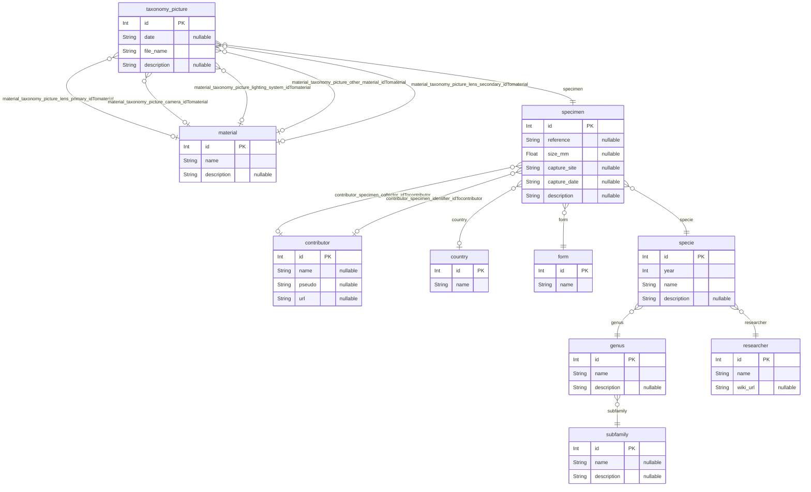

```mermaid
erDiagram

  contributor {
    Int id PK 
    String name  "nullable"
    String pseudo  "nullable"
    String url  "nullable"
    }
  

  country {
    Int id PK 
    String name  
    }
  

  form {
    Int id PK 
    String name  
    }
  

  genus {
    Int id PK 
    String name  
    String description  "nullable"
    }
  

  material {
    Int id PK 
    String name  
    String description  "nullable"
    }
  

  researcher {
    Int id PK 
    String name  
    String wiki_url  "nullable"
    }
  

  specie {
    Int id PK 
    Int year  
    String name  
    String description  "nullable"
    }
  

  specimen {
    Int id PK 
    String reference  "nullable"
    Float size_mm  "nullable"
    String capture_site  "nullable"
    String capture_date  "nullable"
    String description  "nullable"
    }
  

  subfamily {
    Int id PK 
    String name  "nullable"
    String description  "nullable"
    }
  

  taxonomy_picture {
    Int id PK 
    String date  "nullable"
    String file_name  
    String description  "nullable"
    }
  
    genus o{--|| subfamily : "subfamily"
    specie o{--|| researcher : "researcher"
    specie o{--|| genus : "genus"
    specimen o{--|o country : "country"
    specimen o{--|| form : "form"
    specimen o{--|o contributor : "contributor_specimen_collector_idTocontributor"
    specimen o{--|| specie : "specie"
    specimen o{--|o contributor : "contributor_specimen_identifier_idTocontributor"
    taxonomy_picture o{--|o material : "material_taxonomy_picture_lens_primary_idTomaterial"
    taxonomy_picture o{--|o material : "material_taxonomy_picture_camera_idTomaterial"
    taxonomy_picture o{--|o material : "material_taxonomy_picture_lighting_system_idTomaterial"
    taxonomy_picture o{--|| specimen : "specimen"
    taxonomy_picture o{--|o material : "material_taxonomy_picture_other_material_idTomaterial"
    taxonomy_picture o{--|o material : "material_taxonomy_picture_lens_secondary_idTomaterial"
```
