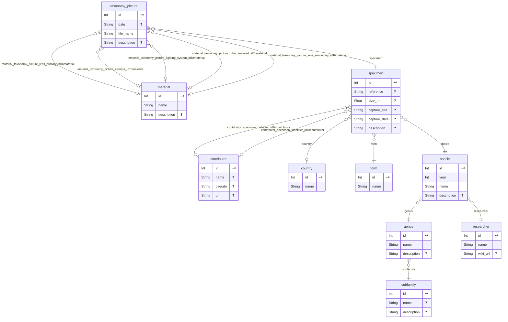

```mermaid
erDiagram

  "contributor" {
    Int id "🗝️"
    String name "❓"
    String pseudo "❓"
    String url "❓"
    }
  

  "country" {
    Int id "🗝️"
    String name 
    }
  

  "form" {
    Int id "🗝️"
    String name 
    }
  

  "genus" {
    Int id "🗝️"
    String name 
    String description "❓"
    }
  

  "material" {
    Int id "🗝️"
    String name 
    String description "❓"
    }
  

  "researcher" {
    Int id "🗝️"
    String name 
    String wiki_url "❓"
    }
  

  "specie" {
    Int id "🗝️"
    Int year 
    String name 
    String description "❓"
    }
  

  "specimen" {
    Int id "🗝️"
    String reference "❓"
    Float size_mm "❓"
    String capture_site "❓"
    String capture_date "❓"
    String description "❓"
    }
  

  "subfamily" {
    Int id "🗝️"
    String name "❓"
    String description "❓"
    }
  

  "taxonomy_picture" {
    Int id "🗝️"
    String date "❓"
    String file_name 
    String description "❓"
    }
  
    "genus" }o--|| "subfamily" : "subfamily"
    "specie" }o--|| "researcher" : "researcher"
    "specie" }o--|| "genus" : "genus"
    "specimen" }o--|o "country" : "country"
    "specimen" }o--|| "form" : "form"
    "specimen" }o--|o "contributor" : "contributor_specimen_collector_idTocontributor"
    "specimen" }o--|| "specie" : "specie"
    "specimen" }o--|o "contributor" : "contributor_specimen_identifier_idTocontributor"
    "taxonomy_picture" }o--|o "material" : "material_taxonomy_picture_lens_primary_idTomaterial"
    "taxonomy_picture" }o--|o "material" : "material_taxonomy_picture_camera_idTomaterial"
    "taxonomy_picture" }o--|o "material" : "material_taxonomy_picture_lighting_system_idTomaterial"
    "taxonomy_picture" }o--|| "specimen" : "specimen"
    "taxonomy_picture" }o--|o "material" : "material_taxonomy_picture_other_material_idTomaterial"
    "taxonomy_picture" }o--|o "material" : "material_taxonomy_picture_lens_secondary_idTomaterial"
```
